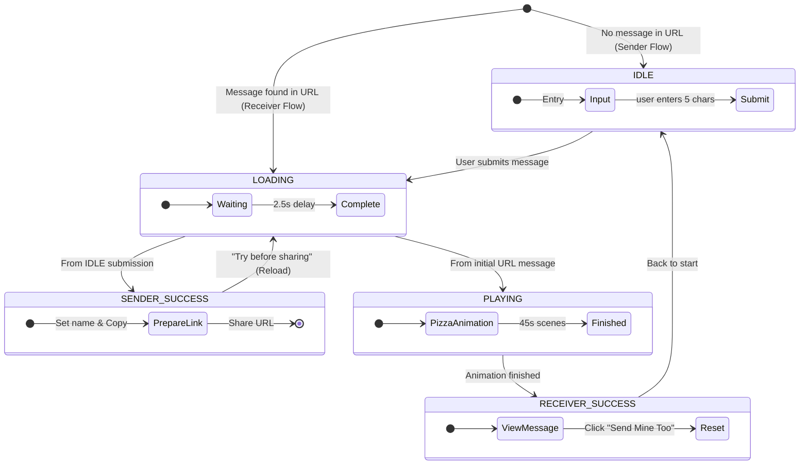

# 🍕 PIZZA

[https://pizza.chaesunbak.com](https://pizza.chaesunbak.com/?message=hello&from=chaesunbak)

## Getting Started

```bash
pnpm install

pnpm run dev
```

## State Diagram


```mermaid
stateDiagram-v2
    [*] --> IDLE: No message in URL (Sender Flow)
    [*] --> LOADING: Message found in URL (Receiver Flow)

    state IDLE {
        direction LR
        [*] --> Input: Entry
        Input --> Submit: user enters 5 chars
    }

    IDLE --> LOADING: User submits message

    state LOADING {
        direction LR
        [*] --> Waiting
        Waiting --> Complete: 2.5s delay
    }

    LOADING --> SENDER_SUCCESS: From IDLE submission
    LOADING --> PLAYING: From initial URL message

    state SENDER_SUCCESS {
        direction LR
        [*] --> PrepareLink: Set name & Copy
        PrepareLink --> [*]: Share URL
    }

    SENDER_SUCCESS --> LOADING: "Try before sharing" (Reload)

    state PLAYING {
        direction LR
        [*] --> PizzaAnimation
        PizzaAnimation --> Finished: 45s scenes
    }

    PLAYING --> RECEIVER_SUCCESS: Animation finished

    state RECEIVER_SUCCESS {
        direction LR
        [*] --> ViewMessage
        ViewMessage --> Reset: Click "Send Mine Too"
    }

    RECEIVER_SUCCESS --> IDLE: Back to start
```
